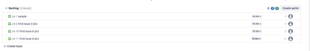

**Flask GitHub to Jira Integration**

**Summary:**

Enable seamless collaboration between GitHub and Jira with this Flask application. Automatically create Jira tickets by commenting "/jira" on GitHub issues. Simple setup, leveraging GitHub webhooks and Jira API integration, enhances project management efficiency. Streamline your workflow effortlessly.

**Prerequisites**

- Jira Account: Ensure you have access to a Jira account with administrative privileges.
- GitHub Repository: You should have a GitHub repository where you want to enable the integration.
- EC2 Server: Where you will Host the Flask Application

**Activity:**

**Generate Jira API Token**

- Log in to your Jira account.
- Navigate to Profile **Settings > Manage your account > Security**.
- Under **API token**, click on Create and **manage API tokens**.
- Click on Create API token and provide a label for identification.
- Copy the generated API token as it will be needed for authentication.

**Flask Application**

Create a Flask Application that automatically create jira tickets by commenting “/jira” on Github issue

**Configure GitHub Webhook**

- In your GitHub repository, go to **Settings > Webhooks > Add webhook**.
- Set the Payload URL to the URL of your Flask application.
- Set the Content type to **application/json**.
- Choose the events you want to trigger the webhook (e.g., Issue comments).
- Set the webhook secret for added security.
- Save the webhook configuration.

**Test the Integration**

- Create an issue in your GitHub repository.
- Comment "/jira" on the GitHub issue to trigger the creation of a corresponding Jira ticket.
- Verify that a new Jira ticket is created with the correct details.

**Conclusion**

In conclusion, this Flask-based GitHub to Jira integration simplifies collaboration by automating Jira ticket creation from GitHub issues. With an intuitive setup, the integration enhances workflow efficiency, bridging the gap between development and project management. Seamlessly connect these platforms for a more streamlined and collaborative development process.
