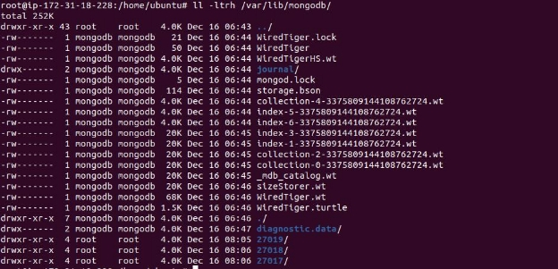
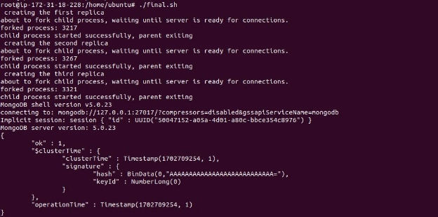

**Shell script to Initiate Mongodb Replicas**

**Prerequisites:**

- Mongodb version 5.0 should have been installed and configured.

**Step1:Killing the old Mongodb process Id**

Killing the old MongoDB process ID involves terminating the existing MongoDB instance to clear resources and facilitate system changes.

Killing the old process Id will help us to setup our read replica with the required ports.

**Step2:Creating members name as ports names**

Creating members with port names in a network environment facilitates easy identification and management. Assigning member names corresponding to port numbers enhances clarity, streamlines organization, and promotes efficient network administration

**Step3: Setting replica set name in mongod.conf**

Configuring a MongoDB replica set name in mongod.conf involves specifying the "replSetName" parameter under the "replication" section.This vital configuration step establishes the identity and coordination of MongoDB instances within the replica set, ensuring proper replication and high availability.

**Step4:Disable javascript execution**

Disable JavaScript execution for enhanced security by limiting potential vulnerabilities and reducing attack vectors in web applications. Minimize risks associated with malicious scripts, protecting user data and privacy.

**Step5: Creating new directories for all replicas**

Creating new directories for all replicas ensures organized storage and data isolation in a MongoDB replica set. This practice maintains clean data separation, supports efficient management, and enhances system reliability by preventing data conflicts and simplifying backup procedures.

**Step6: Configuring all the 3 replicas**

- mongod --port 27017 --dbpath /var/lib/mongodb/primary --logpath /var/lib/mongodb/primary/mongod1.log --replSet rs0 --wiredTigerCacheSizeGB=1 --setParameter enableLocalhostAuthBypass=false --fork
- mongod --port 27018 --dbpath /var/lib/mongodb/secondary1 --logpath /var/lib/mongodb/secondary1/mongod2.log --wiredTigerCacheSizeGB=1 --setParameter enableLocalhostAuthBypass=false --replSet rs0 --fork
- mongod --port 27019 --dbpath /var/lib/mongodb/secondary2 --logpath /var/lib/mongodb/secondary2/mongod3.log --wiredTigerCacheSizeGB=1 --setParameter enableLocalhostAuthBypass=false --replSet rs0 --fork

Configured three MongoDB replicas (27017, 27018, 27019) for replica set 'rs0'. Set data paths, log paths, and WiredTiger cache size to 1GB. Disabled localhost authentication bypass. Each instance forked for background operation.

**Step7: Initialize replica set marking the 3 replica as arbiter**

mongo --port 27017 --eval 'rs.initiate({"\_id":"rs0", "members":[{"\_id":0,"host":"localhost:27017"}, {"\_id":1,"host":"localhost:27018"}, {"\_id":2,"host":"localhost:27019", "arbiterOnly": true}] })'

